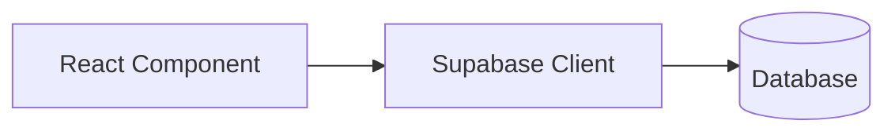
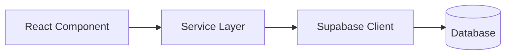

# Architecture Flaws & Tight Coupling Analysis

A comprehensive analysis of **tight coupling**, **code duplication**, and **architectural issues** in the Talent Ops application.

---

## 🚨 Critical Issues Summary

| Issue | Severity | Count | Impact |
|-------|----------|-------|--------|
| **Massive Monolithic Components** | 🔴 Critical | 2+ files | Unmaintainable, hard to test |
| **Duplicated UserContext** | 🔴 Critical | 4 copies | Inconsistent behavior, DRY violation |
| **Scattered Database Queries** | 🔴 Critical | 150+ locations | No single source of truth |
| **Direct Supabase Coupling** | 🟠 High | Every component | Hard to mock/test |
| **No Service Layer for Core Entities** | 🟠 High | - | Logic duplication everywhere |
| **Prop Drilling** | 🟡 Medium | Many components | Complex data flow |

---

## 🔴 1. Monolithic "God" Components

### The Problem

Two components have grown to an **unmaintainable size**:

| File | Lines | Bytes | Functions |
|------|-------|-------|-----------|
| `AllTasksView.jsx` | **3,798** | 234 KB | 34+ |
| `MessagingHub.jsx` | **3,142** | 180 KB | 41+ |

These files violate the **Single Responsibility Principle** — they handle:
- UI rendering
- State management
- Business logic
- Database operations
- Event handling
- Modals and subcomponents

### Evidence: AllTasksView.jsx

```
Functions inside AllTasksView:
├── handleRequestAccess()
├── handleApproveAccess()
├── handleProcessAccessReview()
├── fetchEmployees()
├── fetchData()
├── handleUpdateTask()
├── handleDeleteTask()
├── handleDeleteProof()
├── handleEditTask()
├── handleSaveEdit()
├── handleAddTask()           ← 273 lines alone!
├── downloadCSV()
├── handleApproveTask()
├── handleRejectTask()
├── handleApprovePhase()
├── handleRejectPhase()
├── openIssueModal()
├── resolveIssue()
├── ... 17 more functions
└── LifecycleProgress (sub-component)
```

### Impact
- ❌ **Testing is nearly impossible** — cannot unit test individual functions
- ❌ **Hot reloading is slow** — any change recompiles 3,800 lines
- ❌ **Multiple developers cannot work on it** — merge conflicts guaranteed
- ❌ **Memory overhead** — entire component re-renders on any state change

### Recommendation
Split into smaller components:
```
AllTasksView/
├── index.jsx              (orchestrator, <200 lines)
├── hooks/
│   ├── useTaskData.js     (data fetching)
│   └── useTaskActions.js  (mutations)
├── components/
│   ├── TaskTable.jsx
│   ├── TaskFilters.jsx
│   ├── AddTaskModal.jsx
│   ├── ProofModal.jsx
│   └── IssueModal.jsx
└── TaskService.js          (business logic)
```

---

## 🔴 2. Duplicated UserContext (4 Copies!)

### The Problem

The same `UserContext` is duplicated across **4 different modules**:

| Location | Lines | Unique Features |
|----------|-------|-----------------|
| `executive/context/UserContext.jsx` | 77 | Basic user data |
| `manager/context/UserContext.jsx` | 77 | Same as executive |
| `employee/context/UserContext.jsx` | 135 | **Extra: Auto-checkout logic!** |
| `teamlead/context/UserContext.jsx` | ~77 | Same as executive |

### Evidence: Different Behavior

**Employee version** has extra logic that others don't:
```javascript
// ONLY in employee/context/UserContext.jsx (lines 49-102)
// --- CHECK ATTENDANCE STATUS & AUTO-CHECKOUT ---
const { data: openSessions } = await supabase
    .from('attendance')
    .select('*')
    .eq('employee_id', user.id)
    .is('clock_out', null);

// Auto-checkout stale sessions from past dates...
await supabase.from('attendance').update({
    clock_out: '23:59:00',
    total_hours: totalHours
}).eq('id', session.id);
```

This means:
- ✅ Employee role auto-closes stale attendance
- ❌ Manager role does NOT auto-close stale attendance
- ❌ Executive role does NOT auto-close stale attendance
- **Bug potential**: Behavior differs by dashboard, not by role!

### Impact
- ❌ **Bug: Inconsistent auto-checkout** — depends on which dashboard you use
- ❌ **Maintenance nightmare** — fix in one place, forget the other 3
- ❌ **DRY violation** — same code copied 4 times

### Recommendation
Create a **single shared UserContext**:
```
lib/
└── context/
    └── UserContext.jsx     ← Single source of truth
```

---

## 🔴 3. Scattered Database Queries (No Data Layer)

### The Problem

Direct `supabase.from('tablename')` calls are scattered across **150+ locations**:

| Table | Query Locations |
|-------|-----------------|
| `tasks` table | **50+ files** |
| `profiles` table | **100+ files** |
| `attendance` table | **30+ files** |
| `leaves` table | **20+ files** |

### Evidence: Tasks Table

Direct queries to `from('tasks')` appear in:
```
teamlead/pages/ModulePage.jsx          (lines 506, 525)
teamlead/pages/DashboardHome.jsx       (lines 155, 195)
teamlead/components/TeamTasks.jsx      (lines 235, 340, 400)
teamlead/components/Layout/Header.jsx  (lines 90, 101)
shared/TaskLifecyclePage.jsx           (lines 107, 132, 220)
shared/AllTasksView.jsx                (lines 74, 134, 155, 209, 255, 503, 581, 592, 753, 826, 981, 1005, 1043, 1097, 1114, 1164, 1235, 1453)
manager/pages/ModulePage.jsx           (lines 780, 807, 1111)
manager/pages/DashboardHome.jsx        (lines 103, 124, 300)
... and 30+ more files
```

### Impact
- ❌ **Schema changes require editing 50+ files**
- ❌ **No caching layer** — same data fetched multiple times
- ❌ **No query optimization** — each component writes its own select()
- ❌ **Inconsistent field selection** — some select `*`, some select specific fields
- ❌ **Security risk** — RLS logic must be correct in every component

### Recommendation
Create a **TaskService**:
```javascript
// services/taskService.js
class TaskService {
    async getTasksForUser(userId, orgId) { ... }
    async createTask(taskData) { ... }
    async updateTask(taskId, updates) { ... }
    async approvePhase(taskId, phaseKey, comment) { ... }
}
export const taskService = TaskService.getInstance();
```

---

## 🟠 4. Direct Supabase Coupling in UI Components

### The Problem

**Every component** imports and uses Supabase directly:

```javascript
// Pattern repeated in 100+ components:
import { supabase } from '../../lib/supabaseClient';

const MyComponent = () => {
    useEffect(() => {
        const loadData = async () => {
            const { data } = await supabase.from('tablename').select('*');
            // ...
        };
    }, []);
};
```

### Impact
- ❌ **Cannot mock for testing** — UI is tightly coupled to real DB
- ❌ **No abstraction** — changing from Supabase to Firebase = rewrite everything
- ❌ **Business logic in UI** — components know too much about database schema

### Current Architecture (Bad)


### Recommended Architecture (Good)


---

## 🟠 5. Inconsistent Service Layer

### The Problem

You have **some** services, but they're used **inconsistently**:

| Service | Used By | Not Used By |
|---------|---------|-------------|
| `messageService.js` | MessagingHub | - |
| `employeeService.ts` | Few components | ModulePage (has own logic!) |
| `atsSupabaseService.js` | Hiring Portal | - |
| `invoiceService.js` | Invoice module | - |

Most components **bypass services** and query directly:

```javascript
// MessagingHub uses service (good):
import { sendMessage, getConversationMessages } from '../../services/messageService';

// TaskLifecyclePage does NOT use a service (bad):
const { error } = await supabase.from('tasks').insert({...});
```

### Impact
- ❌ **No single source of truth** for task operations
- ❌ **Behavior is inconsistent** — some features use services, others don't
- ❌ **Testing varies significantly** — some testable, some not

---

## 🟡 6. Prop Drilling

### The Problem

Core props like `userId`, `orgId`, `addToast` are passed through **many layers**:

```javascript
// App.tsx → Dashboard → ModulePage → Component → Subcomponent

// Example from TaskLifecyclePage:
TaskLifecyclePage({ 
    userRole = 'employee', 
    userId,        // Drilled from parent
    orgId,         // Drilled from parent
    addToast,      // Drilled from parent
    projectRole = null, 
    currentProjectId = null, 
    teamId = null  // Drilled from parent
})
```

### Impact
- ❌ **Every intermediate component must forward props**
- ❌ **Refactoring is painful** — adding a new prop requires editing parent chain
- ❌ **Components become coupled to props they don't use**

### Recommendation
Use Context or a global store for common data:
```javascript
// Instead of prop drilling:
const { userId, orgId } = useUser();
const { addToast } = useToast();
```

---

## 📊 Coupling Heatmap

```
Component                    │ Supabase │ UserCtx │ Services │ Utils │
─────────────────────────────┼──────────┼─────────┼──────────┼───────┤
AllTasksView.jsx             │    ████  │    █    │          │   █   │
MessagingHub.jsx             │    ██    │    █    │   ████   │       │
TaskLifecyclePage.jsx        │    ████  │         │          │   █   │
ModulePage.jsx (any)         │    ████  │    ██   │          │       │
DashboardHome.jsx (any)      │    ████  │    ██   │          │       │
─────────────────────────────┴──────────┴─────────┴──────────┴───────┘
Legend: ████ = Heavy coupling
```

---

## ✅ Recommended Fixes (Priority Order)

### 1. **Consolidate UserContext** (Quick Win)
```
components/shared/context/UserContext.jsx  ← Single source
```
- Merge auto-checkout logic
- Delete the 4 duplicates
- Update imports

### 2. **Create TaskService** (High Impact)
```javascript
// services/taskService.js
export const taskService = {
    getTasks: (userId, orgId, filters) => { ... },
    createTask: (taskData) => { ... },
    updateTaskPhase: (taskId, phase, action) => { ... },
    // ... all task operations
};
```

### 3. **Break Up Monolithic Components**
- Split AllTasksView into ~10 smaller components
- Split MessagingHub into ~8 smaller components
- Each component ≤ 300 lines

### 4. **Establish Pattern Guide**
Document and enforce:
- Components MUST NOT import supabase directly
- Components MUST use services for data ops
- Services handle caching, error handling, transformations

---

## 📈 Estimated Technical Debt

| Fix | Effort | Risk | ROI |
|-----|--------|------|-----|
| Consolidate UserContext | 2-4 hours | Low | High |
| Create TaskService | 1-2 days | Medium | Very High |
| Split AllTasksView | 2-3 days | Medium | High |
| Split MessagingHub | 2-3 days | Medium | High |
| Create ProfileService | 0.5-1 day | Low | Medium |

---

> **Summary**: The architecture works but has accumulated significant technical debt. The main issues are (1) lack of a consistent service layer, (2) duplicated contexts with divergent behavior, and (3) massive component files that are impossible to maintain individually.
