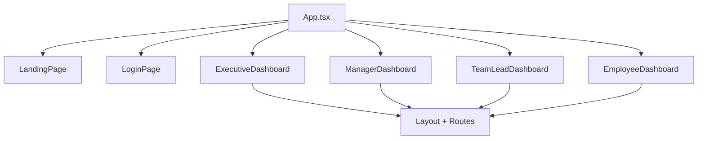
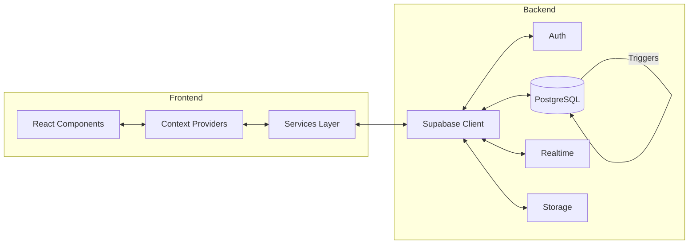

# Talent Ops Architecture Overview

A quick breakdown of the **App Layer** and **Database Architecture** for the Talent Ops application.

---

## 📁 Project Structure

```
Talent Ops/
├── components/         # UI Components (role-based + shared)
│   ├── employee/       # Employee dashboard components
│   ├── executive/      # Executive dashboard components
│   ├── manager/        # Manager dashboard components
│   ├── teamlead/       # Team Lead dashboard components
│   ├── shared/         # Shared/reusable components
│   ├── performance/    # Performance review components
│   ├── landing/        # Landing page components
│   └── pages/          # Route page components
├── lib/                # Core utilities & clients
├── services/           # Business logic services
├── hooks/              # Custom React hooks
├── utils/              # Helper utilities
├── triggers/           # Database triggers & SQL scripts
└── styles/             # Global styles
```

---

## 🖥️ App Layer (Frontend)

### Tech Stack
| Technology | Purpose |
|------------|---------|
| **React + TypeScript** | Core framework |
| **React Router** | Client-side routing |
| **Vite** | Build tool & dev server |
| **TailwindCSS** | Styling |

### Role-Based Architecture

The app uses a **role-based dashboard** pattern with separate experiences for each user type:



| Role | Dashboard Path | Features |
|------|---------------|----------|
| **Executive** | `/executive-dashboard/*` | Analytics, Hiring Portal, Projects, Employees, Payroll |
| **Manager** | `/manager-dashboard/*` | Team management, Task management, Leave requests |
| **Team Lead** | `/teamlead-dashboard/*` | Team coordination, Task tracking |
| **Employee** | `/employee-dashboard/*` | Personal tasks, Leaves, Documents |

### Key Providers & Context

Each dashboard wraps its content with:
- `RoleGuard` - Role-based access control
- `UserProvider` - User state management
- `ToastProvider` - Notifications
- `ATSDataProvider` - ATS (Applicant Tracking System) data
- `ThemeContext` - Dark/light mode theming

---

## 🗄️ Database Architecture (Supabase)

### Connection Setup

The app connects to **Supabase** via `lib/supabaseClient.ts`:

```typescript
// Key Config Options:
- Auth: Persistent sessions, auto-refresh tokens
- Realtime: 10 events/second for live updates
- Schema: 'public'
```

### Core Tables

Based on SQL triggers and schema files:

| Table | Purpose |
|-------|---------|
| `profiles` | User profiles with `technical_scores` (JSONB) |
| `tasks` | Task definitions with `allocated_hours`, `total_points`, `step_duration_setting` |
| `task_submissions` | Task completions with `actual_hours`, `final_points`, `bonus_points`, `penalty_points` |
| `task_steps` | Breakdown of task steps |
| `conversations` | Messaging conversations (DM, Team, Org) |
| `messages` | Chat messages with file attachments |
| `conversation_participants` | Conversation membership & admin status |

### Points System (Triggers)

The database uses PostgreSQL triggers for automatic point calculations:

```
Base Points = allocated_hours × 10

If completed EARLY:  bonus_points = (allocated - actual) × 10
If completed LATE:   penalty_points = (actual - allocated) × 10

Final Points = Base Points + Bonus - Penalty
```

**Related Triggers:**
- `trg_calculate_points` → Calculates final points on task submission
- `trg_update_task_hours` → Updates task hours when steps are modified

---

## 🔧 Services Layer

### Message Service (`services/messageService.js`)

Handles all messaging operations with Supabase:

| Function | Description |
|----------|-------------|
| `getConversationsByCategory()` | Get DMs, Team, or Org conversations |
| `sendMessage()` | Send messages with file attachments |
| `createDMConversation()` | Create direct message threads |
| `createTeamConversation()` | Create team group chats |
| `subscribeToConversation()` | Real-time message subscriptions |
| `addMemberToConversation()` | Admin: add members to groups |
| `promoteMemberToAdmin()` | Admin: promote members |

### Notification Service (`services/notificationService.js`)

Handles push/in-app notifications.

---

## 🔀 Data Flow Diagram



---

## 📊 Feature Modules

| Module | Location | Description |
|--------|----------|-------------|
| **Messaging** | `shared/MessagingHub.jsx` | Full chat system with DMs, Teams, Org-wide |
| **Tasks** | `shared/AllTasksView.jsx` | Task management with steps & points |
| **Payroll** | `shared/PayrollPage.jsx` | Payroll & payslip generation |
| **Hiring** | `executive/pages/HiringPortal/` | Applicant tracking system |
| **Performance** | `performance/` | Employee reviews & rankings |
| **Announcements** | `shared/AnnouncementsPage.jsx` | Company-wide announcements |
| **Attendance** | `shared/AttendanceLogsPage.jsx` | Employee attendance tracking |

---

## 🔐 Security

- **Row Level Security (RLS)** enforced at Supabase level
- **RoleGuard** component for client-side route protection
- **Storage policies** for file upload permissions (`fix_storage_policies.sql`)
