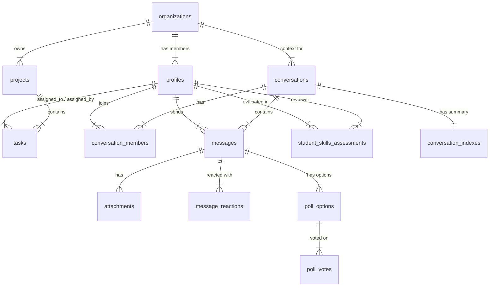

# Database Schema Reference

## 1. Entity Relationship Diagram

## 2. Core Tables

### `public.organizations`
The root entity for multi-tenancy.
-   `id`: UUID (PK)
-   `name`: Text

### `public.profiles`
Extends `auth.users` with application-specific data.
-   `id`: UUID (PK, FK to `auth.users`)
-   `role`: Enum ('executive', 'manager', 'team_lead', 'employee')
-   `org_id`: UUID (FK to `organizations`)
-   `full_name`, `avatar_url`: Text

## 3. Task Management Tables

### `public.tasks`
Core unit of work for students.
-   `id`: BigInt (PK)
-   `title`, `description`: Text
-   `status`: Text ('pending', 'in_progress', 'completed', etc.)
-   `priority`: Text
-   `assigned_to`: UUID (FK to `profiles`)
-   `assigned_by`: UUID (FK to `profiles`)
-   `lifecycle_state`: Text (Workflow state)

### `public.student_task_reviews`
Feedback on specific completed tasks.
-   `task_id`: BigInt (FK)
-   `student_id`: UUID (FK)
-   `score`: Numeric (0-10)
-   `review`: Text

## 4. Messaging Tables

### `public.conversations`
Chat containers (DMs, Groups, Channels).
-   `id`: Text (PK) - Supports GUIDs and custom IDs
-   `type`: Enum ('dm', 'team', 'everyone')
-   `org_id`: UUID (FK)

### `public.messages`
Individual chat messages.
-   `id`: UUID (PK)
-   `conversation_id`: Text (FK)
-   `sender_user_id`: UUID (FK)
-   `content`: Text
-   `message_type`: Text ('chat', 'poll', etc.)
-   `reply_to_id`: UUID (Self-reference)

### `public.message_reactions`
Emoji reactions to messages.
-   `message_id`: UUID (FK)
-   `user_id`: UUID (FK)
-   `emoji`: Text

## 5. Assessment Tables

### `public.student_skills_assessments`
Periodic evaluation of student growth.
-   `student_id`: UUID (FK)
-   `period_type`: Enum ('weekly', 'monthly')
-   `soft_skill_traits`: JSONB (Key-value scores)
-   `development_skill_traits`: JSONB (Key-value scores)
-   `reviewer_id`: UUID (FK)
