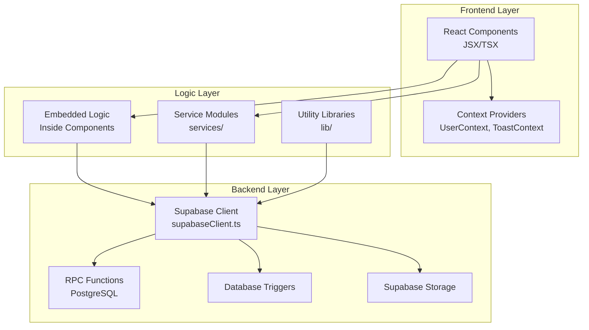
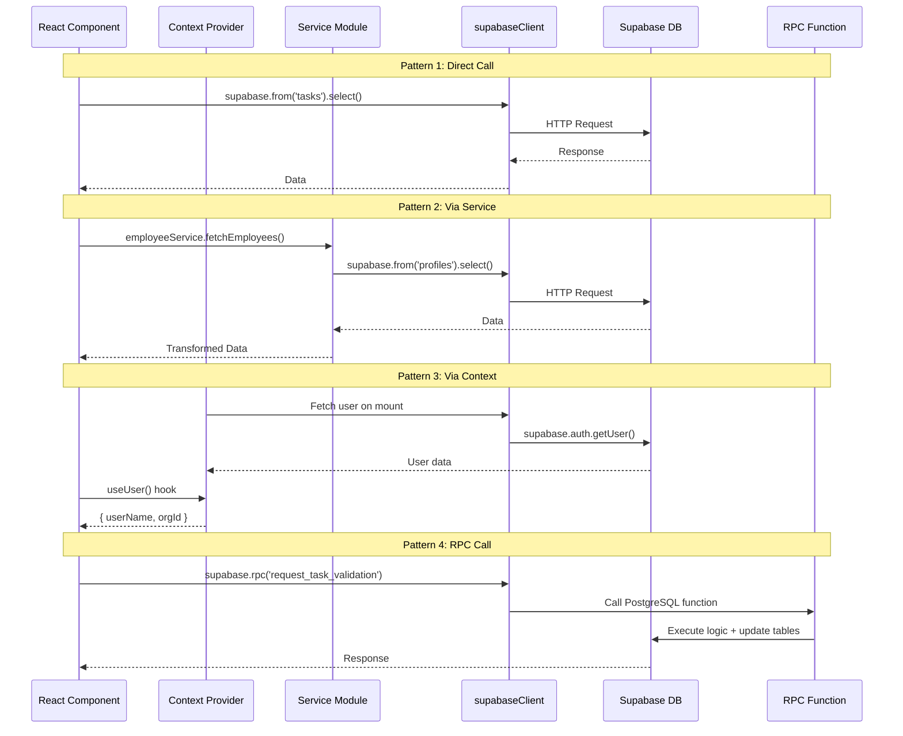

# Logic Layer Architecture - Talent Ops

A detailed explanation of how the **Logic Layer** works and communicates with the **Frontend** in the Talent Ops application.

---

## 🏗️ Architecture Pattern: **Component-Embedded Logic with Centralized Services**

Your application uses a **hybrid architecture** that combines:
1. **Embedded Business Logic** - Logic inside React components
2. **Centralized Service Modules** - Reusable service files
3. **Context Providers** - State management across components
4. **Database RPC Functions** - Server-side logic in Supabase



---

## 📍 Logic Layer Locations

| Location | Purpose | Pattern |
|----------|---------|---------|
| `components/**/*.jsx` | **Embedded Logic** - CRUD operations inside components | Inline `supabase` calls |
| `services/` | **Global Services** - Messaging, Notifications | Service modules |
| `components/*/services/` | **Module-Specific Services** - ATS, Employee data | Domain services |
| `lib/` | **Utilities** - Supabase client, Business hours calc | Shared utilities |
| `components/*/context/` | **State Management** - User, Toast, Project state | React Context |
| `triggers/*.sql` | **Database Logic** - Points calculation, RLS | PostgreSQL triggers/functions |

---

## 🔄 Communication Flow

### Pattern 1: Component → Supabase (Direct)

Most components in your app **directly call Supabase** for data operations. This is your primary pattern.

**Example from `TaskLifecyclePage.jsx`:**

```javascript
// Component imports Supabase client directly
import { supabase } from '../../lib/supabaseClient';

// Business logic embedded in the component
const fetchTasks = async () => {
    const { data: { user } } = await supabase.auth.getUser();
    
    let query = supabase
        .from('tasks')
        .select('*')
        .eq('assigned_to', user.id)
        .eq('org_id', orgId);
        
    const { data: tasksData, error } = await query;
    // ... handle response
};
```

**Flow Diagram:**
```
┌─────────────────────┐
│  TaskLifecyclePage  │
│     (Component)     │
└─────────┬───────────┘
          │ import
          ▼
┌─────────────────────┐
│   supabaseClient    │
│      (lib/)         │
└─────────┬───────────┘
          │ HTTP/WebSocket
          ▼
┌─────────────────────┐
│     Supabase        │
│    (PostgreSQL)     │
└─────────────────────┘
```

---

### Pattern 2: Component → Service → Supabase

For complex or reusable logic, you use **service modules**.

**Example: EmployeeService (Singleton Pattern)**

```typescript
// services/employeeService.ts
class EmployeeService {
    private static instance: EmployeeService;
    private employeeCache: Map<string, Employee[]> = new Map();
    
    static getInstance(): EmployeeService {
        if (!EmployeeService.instance) {
            EmployeeService.instance = new EmployeeService();
        }
        return EmployeeService.instance;
    }
    
    async fetchEmployees(orgId: string): Promise<Employee[]> {
        const { data } = await supabase
            .from('profiles')
            .select('*')
            .eq('org_id', orgId);
        // ... transform and cache
    }
}

export const employeeService = EmployeeService.getInstance();
```

**Usage in Component:**
```javascript
import { employeeService } from '../services/employeeService';

// In component
useEffect(() => {
    const loadEmployees = async () => {
        const employees = await employeeService.fetchEmployees(orgId);
        setEmployees(employees);
    };
    loadEmployees();
}, [orgId]);
```

---

### Pattern 3: Context Providers (State Distribution)

**Context Providers** manage shared state and distribute it to child components.

**Example: UserContext.jsx**
```javascript
export const UserProvider = ({ children }) => {
    const [userName, setUserName] = useState('Loading...');
    const [userId, setUserId] = useState(null);
    const [orgId, setOrgId] = useState(null);
    
    useEffect(() => {
        const fetchUserData = async () => {
            const { data: { user } } = await supabase.auth.getUser();
            
            const { data: profile } = await supabase
                .from('profiles')
                .select('full_name, role, org_id')
                .eq('id', user.id)
                .single();
                
            setUserName(profile.full_name);
            setOrgId(profile.org_id);
        };
        fetchUserData();
    }, []);
    
    return (
        <UserContext.Provider value={{ userName, userId, orgId }}>
            {children}
        </UserContext.Provider>
    );
};
```

**Usage:**
```javascript
import { useUser } from '../context/UserContext';

const MyComponent = () => {
    const { userName, orgId } = useUser();
    // Use the data...
};
```

---

### Pattern 4: RPC Functions (Server-Side Logic)

Complex business logic runs on the **database level** via PostgreSQL functions.

**Calling RPC from Component:**
```javascript
// Get task history via RPC
const { data, error } = await supabase.rpc('get_task_history', { 
    p_task_id: taskId 
});

// Request task validation via RPC
const { data, error } = await supabase.rpc('request_task_validation', {
    p_task_id: taskForProof.id,
    p_user_id: user.id,
    p_proof_url: proofUrl,
    p_proof_text: proofText
});
```

---

## 📂 Detailed Service Locations

### Global Services (`/services/`)

| File | Purpose | Key Functions |
|------|---------|---------------|
| `messageService.js` | Chat/messaging operations | `sendMessage()`, `createDMConversation()`, `subscribeToConversation()` |
| `notificationService.js` | Push/in-app notifications | Notification handling |

### Module-Specific Services

| Path | Purpose |
|------|---------|
| `components/executive/services/atsSupabaseService.js` | ATS (Hiring) CRUD operations |
| `components/executive/services/invoiceService.js` | Invoice management |
| `components/shared/services/employeeService.ts` | Centralized employee data management |

### Context Providers (`/context/`)

| Path | Purpose |
|------|---------|
| `components/executive/context/UserContext.jsx` | User auth state |
| `components/executive/context/ToastContext.jsx` | Toast notifications |
| `components/executive/context/ATSDataContext.jsx` | ATS data management |
| `components/employee/context/ProjectContext.jsx` | Project state |

### Utility Libraries (`/lib/`)

| File | Purpose |
|------|---------|
| `supabaseClient.ts` | Supabase connection (single instance) |
| `businessHoursUtils.js` | Due date calculations |
| `supabaseRequest.js` | HTTP request helpers |

---

## 🔁 Real-Time Updates Pattern

Your app uses **Supabase Realtime** for live updates:

```javascript
// In employeeService.ts
subscribeToUpdates(orgId, callback) {
    const channel = supabase
        .channel(`employee-status-${orgId}`)
        .on('postgres_changes',
            { event: '*', schema: 'public', table: 'attendance' },
            async () => {
                const employees = await this.fetchEmployees(orgId);
                callback(employees);
            }
        )
        .subscribe();
}

// In messageService.js
subscribeToConversation(conversationId, callbacks) {
    return supabase
        .channel(`messages:${conversationId}`)
        .on('postgres_changes',
            { event: 'INSERT', schema: 'public', table: 'messages' },
            (payload) => callbacks.onNewMessage?.(payload.new)
        )
        .subscribe();
}
```

---

## 📊 Complete Communication Diagram



---

## ✅ Summary

| Aspect | Implementation |
|--------|----------------|
| **Primary Pattern** | Component-embedded Supabase calls |
| **State Management** | React Context (UserContext, ToastContext) |
| **Reusable Logic** | Service modules (singleton pattern) |
| **Real-time Updates** | Supabase Realtime subscriptions |
| **Server Logic** | PostgreSQL RPC functions & triggers |
| **Database** | Supabase (PostgreSQL) |
| **Authentication** | Supabase Auth |
| **File Storage** | Supabase Storage |

> **Note:** Your architecture is a practical, component-centric approach where most logic lives close to the UI. Complex or shared operations are extracted into services and contexts. Database triggers handle automated calculations (like points).
