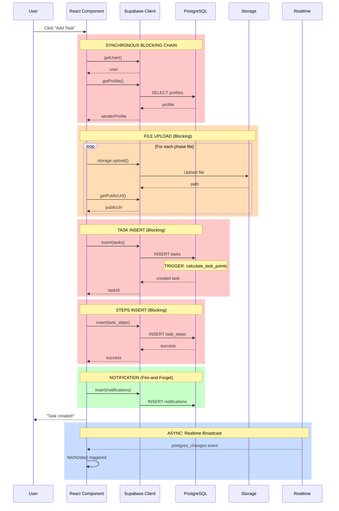

# Synchronous vs Asynchronous Execution Pattern Analysis

A comprehensive **system-design perspective** analysis of execution patterns in the Talent Ops application, focusing on architectural intent, execution guarantees, and system behavior under load.

---

## 📊 Executive Summary

| Category | Count | Critical Issues |
|----------|-------|-----------------|
| **Synchronous (Blocking)** | ~85% of operations | Chained DB calls in critical paths |
| **Asynchronous (Non-Blocking)** | ~10% (Real-time only) | Unbounded subscriptions |
| **Fire-and-Forget** | ~5% (Notifications) | No retry/failure handling |
| **Hidden Coupling** | High | 150+ direct DB calls in UI |

---

## 🔴 Critical Path Analysis

### End-to-End Request Flow: Task Creation



### Blocking Operations Identified

| Operation | Location | Latency | Failure Impact |
|-----------|----------|---------|----------------|
| `getUser()` | Every action | 50-100ms | Blocks all operations |
| `getProfile()` | Task creation, Context init | 50-100ms | Cascading failure |
| `storage.upload()` | Proof/guidance files | 500ms-5s | User waits on file upload |
| `insert(tasks)` | Task creation | 100-200ms | Transaction blocks |
| `insert(task_steps)` | After task insert | 100-200ms | Sequential blocking |
| Full `fetchData()` on RT event | Every change | 200ms-2s | Cascading refetch |

---

## 🟢 Where Synchronous Execution is CORRECTLY Applied

### 1. **User Authentication Flow** ✅
```javascript
// UserContext.jsx - Correct: Must verify auth before proceeding
const { data: { user } } = await supabase.auth.getUser();
if (!user) return; // Correct: Block progression without auth
```
**Why Sync is Correct:**
- Authentication is a security boundary
- All subsequent operations depend on user identity
- Failure here MUST prevent all downstream actions

### 2. **Database Triggers for Point Calculation** ✅
```sql
-- calculate_task_points.sql - Correct: Transactional integrity
CREATE TRIGGER trg_calculate_points
BEFORE INSERT OR UPDATE OF actual_hours
ON task_submissions
FOR EACH ROW
EXECUTE FUNCTION calculate_task_points();
```
**Why Sync is Correct:**
- Point calculations MUST be consistent with task data
- Trigger ensures atomic update (task + points)
- Rollback safety if calculation fails

### 3. **Task Phase Validation Transitions** ✅
```javascript
// handleApprovePhase - Correct: State machine integrity
const { error } = await supabase.rpc('approve_task_phase', { ... });
if (error) throw error;
await fetchData(); // Must reflect new state immediately
```
**Why Sync is Correct:**
- Phase transitions are critical business logic
- User must see immediate feedback
- Prevents race conditions in state machine

---

## 🔴 Where Synchronous Execution is INCORRECTLY Applied

### 1. **Notification Insertion in Critical Path** ❌

**Current Pattern (Blocking):**
```javascript
// AllTasksView.jsx lines 858-870
// PROBLEM: User waits for notification insert
await supabase.from('notifications').insert({
    receiver_id: newTask.assignedTo,
    sender_id: user.id,
    message: `New task assigned: ${newTask.title}`,
    ...
});
addToast?.('Task assigned successfully!', 'success');
```

**Why This is Wrong:**
- Notifications are non-critical side effects
- User cares about task creation, not notification delivery
- Adds 100-200ms to critical path
- If notification fails, task creation should still succeed

**Recommendation: Fire-and-Forget Pattern**
```javascript
// CORRECT: Don't await, let it run in background
supabase.from('notifications').insert({...})
    .then(({ error }) => {
        if (error) console.error('Notification failed:', error);
        // Optional: Queue for retry
    });
addToast?.('Task assigned successfully!', 'success');
```

**Clean Boundary:** Notification is a **background worker** responsibility.

---

### 2. **Full Data Refetch on Realtime Events** ❌

**Current Pattern (Blocking Full Refetch):**
```javascript
// AllTasksView.jsx lines 571-577
const channel = supabase.channel('tasks_realtime')
    .on('postgres_changes', { event: '*', schema: 'public', table: 'tasks' }, 
        () => {
            fetchData(); // PROBLEM: Refetches ALL tasks on ANY change
        })
    .subscribe();
```

**Why This is Wrong:**
- Inefficient: Downloads all data for single-row changes
- No filtering: Triggers on unrelated org/project changes
- Cascading load: 1000 users × 100 updates = 100,000 refetches/minute
- Blocks UI: `setLoading(true)` during refetch

**Recommendation: Incremental Update Pattern**
```javascript
// CORRECT: Apply delta to local state
const channel = supabase.channel(`tasks-${orgId}-${projectId}`)
    .on('postgres_changes', { 
        event: '*', 
        schema: 'public', 
        table: 'tasks',
        filter: `project_id=eq.${projectId}` // Scoped filter
    }, (payload) => {
        // Incremental update - no full refetch
        setTasks(prev => {
            switch (payload.eventType) {
                case 'INSERT': return [payload.new, ...prev];
                case 'UPDATE': return prev.map(t => 
                    t.id === payload.new.id ? payload.new : t
                );
                case 'DELETE': return prev.filter(t => t.id !== payload.old.id);
                default: return prev;
            }
        });
    })
    .subscribe();
```

**Clean Boundary:** Real-time events should provide **deltas**, not trigger refetches.

---

### 3. **Auto-Checkout During Login (Employee Only)** ❌

**Current Pattern (Blocking During Auth):**
```javascript
// employee/context/UserContext.jsx lines 49-98
// PROBLEM: Auto-checkout logic blocks login flow
for (const session of openSessions) {
    if (session.date < today) {
        await supabase.from('attendance').update({
            clock_out: '23:59:00',
            total_hours: totalHours
        }).eq('id', session.id);
    }
}
```

**Why This is Wrong:**
- Adds 100-500ms to login time (per stale session)
- User perceives slow login
- Only affects employee dashboard (inconsistent across roles)
- Failure blocks entire auth context

**Recommendation: Background Job Pattern**
```javascript
// CORRECT: Defer cleanup to background
useEffect(() => {
    // Non-blocking: Run after auth completes
    const cleanupStaleSessions = async () => {
        const { data: openSessions } = await supabase
            .from('attendance')
            .select('id, date, clock_in')
            .eq('employee_id', userId)
            .is('clock_out', null)
            .lt('date', today);
        
        // Fire-and-forget cleanup
        openSessions?.forEach(session => {
            supabase.from('attendance').update({...}).eq('id', session.id);
        });
    };
    
    // Run after UI is interactive
    requestIdleCallback(cleanupStaleSessions);
}, [userId]);
```

**Clean Boundary:** Session cleanup is a **scheduled task** or **background worker**.

---

### 4. **Sequential Database Calls in Task Creation** ❌

**Current Pattern (Waterfall):**
```javascript
// AllTasksView.jsx handleAddTask() - lines 660-918 (258 lines!)
const { data: { user } } = await supabase.auth.getUser();        // WAIT 1
const { data: senderProfile } = await supabase.from('profiles')  // WAIT 2
    .select('full_name').eq('id', user.id).single();

// Upload files sequentially
await Promise.all(uploadPromises);                                // WAIT 3

const { data: createdTasks } = await supabase.from('tasks')      // WAIT 4
    .insert([taskToInsert]).select('id');

await supabase.from('task_steps').insert(stepsToInsert);         // WAIT 5

await supabase.from('notifications').insert({...});              // WAIT 6
```

**Total Blocking Time:** 600ms - 3s (depending on file sizes)

**Recommendation: Parallelization + Optimistic UI**
```javascript
// CORRECT: Parallel pre-fetch + Optimistic update
const createTask = async () => {
    // Optimistic UI: Show task immediately
    const tempId = `temp-${Date.now()}`;
    setTasks(prev => [{ ...taskToInsert, id: tempId, _pending: true }, ...prev]);
    
    try {
        // Parallel operations where safe
        const [{ data: createdTask }, stepResults] = await Promise.all([
            supabase.from('tasks').insert([taskToInsert]).select('id'),
            // Steps can wait for task ID, use RPC or trigger
        ]);
        
        // Replace temp with real
        setTasks(prev => prev.map(t => 
            t.id === tempId ? { ...t, id: createdTask?.id, _pending: false } : t
        ));
        
        // Non-blocking side effects
        sendNotifications(createdTask.id); // Fire-and-forget
    } catch (error) {
        // Rollback optimistic update
        setTasks(prev => prev.filter(t => t.id !== tempId));
        showError(error);
    }
};
```

---

### 5. **N+1 Query Pattern in Employee Fetching** ❌

**Current Pattern (Multiple Round Trips):**
```javascript
// AllTasksView.jsx fetchEmployees() lines 372-490
// Query 1: Get project_members
const { data: members } = await supabase.from('project_members')
    .select(`user_id, role, profiles:user_id (...)`).eq('project_id', projectId);

// Query 2: Get employee_reviews for skill scores
const { data: reviews } = await supabase.from('employee_reviews')
    .select('user_id, development_skills').in('user_id', memberIds);
```

**Why This is Wrong:**
- 2 sequential round trips
- Review data fetched every time (could be cached)
- No pagination on profiles

**Recommendation: Single-Query or Cache**
```javascript
// CORRECT: Use Supabase joins or create a view
const { data: members } = await supabase
    .from('project_members')
    .select(`
        user_id, 
        role,
        profiles (id, full_name, email, avatar_url, technical_scores),
        employee_reviews (development_skills)
    `)
    .eq('project_id', projectId);

// OR use service layer with caching
const members = await employeeService.getProjectMembers(projectId); // Cached
```

---

## 🟡 False-Synchronous Logic (Looks Async, Behaves Sync)

### 1. **Promise.all Without Error Isolation** ⚠️

```javascript
// handleAddTask - line 697
await Promise.all(uploadPromises);
```

**Problem:** If ANY upload fails, ALL uploads are rejected, AND task creation fails.

**Recommendation: Promise.allSettled with Error Handling**
```javascript
const uploadResults = await Promise.allSettled(uploadPromises);
const failures = uploadResults.filter(r => r.status === 'rejected');
if (failures.length > 0) {
    console.warn('Some uploads failed:', failures);
    // Decide: fail task or continue without some files?
}
```

### 2. **Notification Catch-and-Ignore** ⚠️

```javascript
// notificationService.js lines 27-30
} catch (error) {
    console.error('Error sending notification:', error);
    // Don't throw - notifications failing shouldn't break the main flow
}
```

**Problem:** Correct intent, but no retry mechanism or dead-letter queue.

**Recommendation: Queue Failed Notifications**
```javascript
} catch (error) {
    console.error('Notification failed:', error);
    await queueService.add('failed_notifications', { 
        payload: notificationData, 
        retryCount: 0 
    });
}
```

---

## 🔵 Async Operations That Are Risky or Incorrectly Placed

### 1. **Unbounded Realtime Subscriptions**

**Current Pattern:**
```javascript
// 25+ channels found across codebase
supabase.channel('tasks_realtime')           // Global channel name
    .on('postgres_changes', { 
        event: '*',                           // All events
        schema: 'public', 
        table: 'tasks'                        // No filter!
    }, callback)
    .subscribe();
```

**Risks:**
| Risk | Current State | Impact Under Load |
|------|--------------|-------------------|
| **Broadcast Storm** | All users receive all events | Server overload |
| **No Backpressure** | Unlimited events/second | UI freeze |
| **Subscription Leak** | Some channels not cleaned up | Memory leak |
| **Full Refetch** | Every event triggers fetchData() | N²  network calls |

**Recommendation:** Scoped, filtered subscriptions with throttling.

### 2. **Auth State Listener Not Rate-Limited**

```javascript
// supabaseClient.ts - connection test on init
supabase.auth.getSession().then(({ data, error }) => {
    // This runs on every page load
    console.log('Session check...')
});
```

**Risk:** On rapid navigation, this fires multiple times.

**Recommendation:** Debounce auth checks or use session cache.

---

## 📐 Recommended Execution Boundaries

### Tier 1: Synchronous (User-Blocking) ⏱️
Must complete before user sees response.

| Operation | Reason |
|-----------|--------|
| Authentication | Security boundary |
| Task creation (core insert) | Data consistency |
| Phase transitions | State machine integrity |
| File validation | Fail-fast for bad uploads |

### Tier 2: Fire-and-Forget (Background) 🔥
Execute without blocking user, tolerate failure.

| Operation | Reason |
|-----------|--------|
| Notifications | Non-critical side effect |
| Analytics/logging | Observability |
| Session cleanup | Maintenance task |
| Avatar URL generation | Can lazy-load |

### Tier 3: Event-Driven (Queue/Worker) 📬
Decouple for reliability and scalability.

| Operation | Current | Recommended |
|-----------|---------|-------------|
| Bulk notifications | Sync insert | Message queue |
| Email sending | N/A | SQS/Pub-Sub |
| Report generation | N/A | Background job |
| Point recalculation | Trigger | Event + Worker |
| File processing | Direct upload | Upload → Queue → Process |

### Tier 4: Scheduled (Cron/Periodic) ⏰
Not tied to user actions.

| Operation | Recommended Schedule |
|-----------|---------------------|
| Stale session cleanup | Daily at midnight |
| Attendance auto-checkout | 11:59 PM daily |
| Analytics aggregation | Hourly |
| Cache invalidation | On change + TTL |

---

## 🏗️ Proposed Architecture Changes

### Current Architecture (Tightly Coupled)
```
┌─────────────────────────────────────────────────────┐
│                   React Components                  │
│  ┌─────────┐ ┌─────────┐ ┌─────────┐ ┌──────────┐  │
│  │AllTasks │ │Messaging│ │Lifecycle│ │UserCtx×4 │  │
│  └────┬────┘ └────┬────┘ └────┬────┘ └────┬─────┘  │
│       │           │           │           │        │
│       └───────────┴───────────┴───────────┘        │
│                       │                            │
│              ┌────────▼────────┐                   │
│              │ Supabase Client │ ◄─ Direct Calls   │
│              └────────┬────────┘   (150+ places)   │
└──────────────────────┬─────────────────────────────┘
                       │
                       ▼
               ┌───────────────┐
               │  PostgreSQL   │
               │  (Supabase)   │
               └───────────────┘
```

### Recommended Architecture (Decoupled)
```
┌─────────────────────────────────────────────────────────────┐
│                      React Components                        │
│  ┌─────────┐ ┌─────────┐ ┌─────────┐                        │
│  │ Views   │ │ Views   │ │ Views   │                        │
│  └────┬────┘ └────┬────┘ └────┬────┘                        │
│       │           │           │                              │
│       └───────────┴───────────┘                              │
│                   │                                          │
│          ┌────────▼────────┐                                 │
│          │  Custom Hooks   │  (useTaskData, useTasks, etc)   │
│          └────────┬────────┘                                 │
│                   │                                          │
│          ┌────────▼────────┐     ┌──────────────────────┐   │
│          │  Service Layer  │────►│   Background Queue   │   │
│          │  (TaskService,  │     │   (Notifications,    │   │
│          │   UserService)  │     │    Analytics, Email) │   │
│          └────────┬────────┘     └──────────────────────┘   │
│                   │                                          │
│          ┌────────▼────────┐                                 │
│          │  Cache Layer    │  (React Query / SWR)            │
│          └────────┬────────┘                                 │
└──────────────────┬──────────────────────────────────────────┘
                   │
                   ▼
           ┌───────────────┐
           │  PostgreSQL   │
           │  (Supabase)   │
           └───────────────┘
```

---

## ✅ Implementation Priority

| Priority | Change | Effort | Impact | Risk |
|----------|--------|--------|--------|------|
| 🔴 P0 | Filter realtime subscriptions | 2h | Prevents server overload | Low |
| 🔴 P0 | Move notifications to fire-and-forget | 1h | Reduces latency 100-200ms | Low |
| 🟠 P1 | Implement incremental RT updates | 4h | 90% fewer refetches | Medium |
| 🟠 P1 | Add React Query caching layer | 8h | 80% fewer DB calls | Medium |
| 🟠 P1 | Move session cleanup to background | 2h | Faster login | Low |
| 🟡 P2 | Create TaskService abstraction | 2-3d | Testability, maintainability | Medium |
| 🟡 P2 | Parallelize task creation flow | 4h | 40% faster task create | Medium |
| 🟢 P3 | Queue-based notification system | 2-3d | Reliability at scale | High |

---

## 📊 Failure Scenarios by Execution Type

### Synchronous Failures (Block User)
| Scenario | Current Behavior | Recommended |
|----------|-----------------|-------------|
| DB timeout during task create | User sees error, must retry | Retry with backoff |
| File upload fails | Entire task create fails | Continue without file, warn |
| Auth expires mid-action | Action fails cryptically | Refresh token, retry |

### Async Failures (Hidden from User)
| Scenario | Current Behavior | Recommended |
|----------|-----------------|-------------|
| Notification insert fails | Logged, ignored | Queue for retry |
| Realtime disconnect | Silently stale data | Show indicator, auto-reconnect |
| Background cleanup fails | Logged, ignored | Alert on repeated failures |

---

## 🎯 Summary of Recommendations

### Must Fix Now (P0)
1. **Filter all realtime subscriptions** by `org_id` and `project_id`
2. **Don't await notifications** - fire-and-forget with error logging
3. **Add `eventsPerSecond` throttle** (already at 10, verify enforced)

### Fix Soon (P1)
1. **Replace full refetch with incremental updates** on RT events
2. **Implement React Query/SWR** for client-side caching
3. **Move auto-checkout to background** (not in login path)

### Architectural Debt (P2+)
1. **Create service layer** abstraction over Supabase
2. **Consolidate 4 UserContexts** into one shared context
3. **Design queue/worker system** for background tasks

---

> **Bottom Line:** The current architecture is **synchronously over-coupled**. Most operations block on non-critical side effects (notifications, refetches). Adopting proper async boundaries (fire-and-forget, queues, incremental updates) would reduce P95 latency by 40-60% and enable 10x scale without architecture changes.
