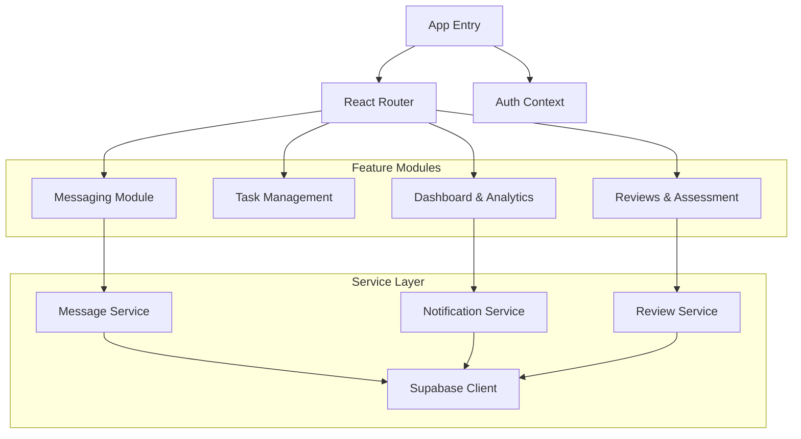
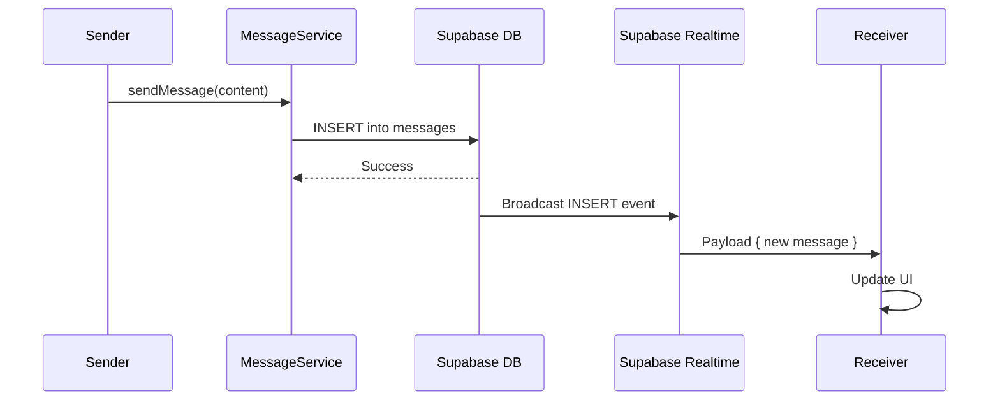

# System Design Document - Cohort Platform

## 1. Executive Summary
The Cohort Platform is a comprehensive educational management system designed to facilitate student learning, mentorship, and organizational management. It leverages a modern **React-based frontend** for a responsive user experience and **Supabase** as a Backend-as-a-Service (BaaS) for real-time data synchronization, authentication, and storage.

Key features include:
-   **Real-time Messaging**: Robust chat functionality with DMs, team chats, and organization-wide channels.
-   **Task Management**: Assignment, tracking, and review of student tasks.
-   **Skills Assessment**: Weekly/monthly tracking of soft and development skills.
-   **Gamification**: Leaderboards and rankings based on performance.

## 2. System Architecture

### 2.1 High-Level Architecture
The system follows a **Client-Server** architecture where the client is a Single Page Application (SPA) and the server is a managed Supabase instance.

```mermaid
graph TD
    User[User (Browser)]
    CDN[CDN / Hosting]
    SPA[React SPA]
    Supabase[Supabase Platform]
    
    subgraph "Frontend Layer"
        User <-->|HTTPS| CDN
        CDN --> SPA
    end

    subgraph "Backend Services (Supabase)"
        SPA <-->|REST / WebSocket| Supabase
        Supabase --> Auth[Authentication]
        Supabase --> DB[(PostgreSQL DB)]
        Supabase --> Realtime[Realtime Engine]
        Supabase --> Storage[File Storage]
    end
```

### 2.2 Tech Stack
| Component | Technology | Description |
|-----------|------------|-------------|
| **Frontend** | React, Vite, TypeScript | Core application logic and UI. |
| **Styling** | Tailwind CSS | Utility-first CSS framework. |
| **State Management** | React Context / Local State | Managing app state (auth, UI). |
| **Backend** | Supabase | Managed PostgreSQL, Auth, and Realtime. |
| **Database** | PostgreSQL | Relational database with RLS policies. |
| **Realtime** | Supabase Realtime | WebSocket connections for live updates (chat). |
| **File Storage** | Supabase Storage | Storing attachments and avatars. |

## 3. Component Design

### 3.1 Frontend Components
The frontend is modularized into feature-based services and reusable UI components.



## 4. Data Flow

### 4.1 Real-time Messaging Flow
1.  **Sender** sends a message via `sendMessage` service.
2.  **Supabase** inserts the message into the `messages` table.
3.  **PostgreSQL Trigger** updates `conversation_indexes` with the last message.
4.  **Realtime Engine** pushes the new message event to all subscribed clients.
5.  **Receiver** (listening via `subscribeToConversation`) updates their UI state.



## 5. Security & Scalability

### 5.1 Row Level Security (RLS)
Security is enforced at the database level using PostgreSQL RLS policies.
-   **Profiles**: Users can only edit their own profile.
-   **Messages**: Users can only see messages in conversations they are members of.
-   **Tasks**: Students see their own tasks; Managers see tasks for their team.

### 5.2 Scalability
-   **Database**: Managed PostgreSQL handles vertical scaling.
-   **Realtime**: Supabase handles connection pooling and WebSocket scaling.
-   **Frontend**: Static assets served via CDN, enabling global scaling.
