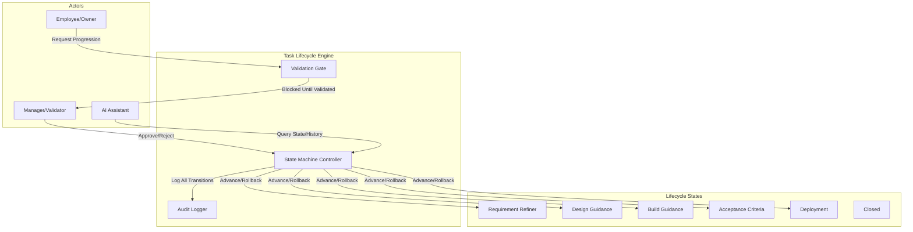
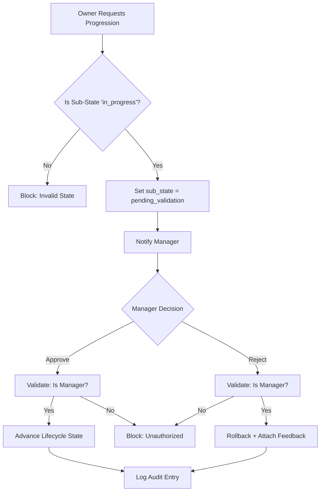

# Automated Task Lifecycle with Mandatory Manager Validation
## Talent Ops Enterprise Feature Design

---

## 1. High-Level Architecture



### Architectural Principles

| Principle | Implementation |
|-----------|----------------|
| **State-Driven** | Tasks defined by lifecycle state, not completion % |
| **Validation-Gated** | Every transition requires manager approval |
| **Role-Agnostic** | Even executives cannot self-approve |
| **Audit-Complete** | Every action logged with actor, time, context |
| **Decoupled** | Backend logic independent of frontend |

---

## 2. Lifecycle States & Sub-States

### 2.1 Lifecycle Flow

```
┌─────────────────────────────────────────────────────────────────────────┐
│  REQUIREMENT_REFINER → DESIGN_GUIDANCE → BUILD_GUIDANCE →              │
│  ACCEPTANCE_CRITERIA → DEPLOYMENT → [CLOSED]                           │
└─────────────────────────────────────────────────────────────────────────┘
```

### 2.2 Sub-States Within Each Phase

| Sub-State | Description |
|-----------|-------------|
| `in_progress` | Owner is actively working |
| `pending_validation` | Awaiting manager approval |
| `approved` | Manager approved; system advances |
| `rejected` | Manager rejected; rolls back with feedback |

---

## 3. Validation Gate Logic



---

## 4. State Transition Matrix

| Current State | Action | Actor | Result |
|---------------|--------|-------|--------|
| `in_progress` | `request_validation` | Owner | → `pending_validation` |
| `pending_validation` | `approve` | Manager | → Next lifecycle state |
| `pending_validation` | `reject` | Manager | → Same state + feedback |
| `pending_validation` | `cancel_request` | Owner | → `in_progress` |
| `DEPLOYMENT` + `approved` | Auto | System | → `CLOSED` |

### Transition Rules

```
RULE 1: No forward movement without validation
RULE 2: Rejection resets sub-state only (work preserved)
RULE 3: validated_by ≠ task.assigned_to (no self-validation)
RULE 4: After DEPLOYMENT.approved → task is CLOSED (terminal)
```

---

## 5. Authority Matrix

| Role | Work on Task | Request Validation | Approve/Reject |
|------|--------------|-------------------|----------------|
| Employee | Own tasks | ✓ | ✗ |
| Team Lead | Team tasks | ✓ | ✗ |
| Manager | Dept tasks | ✓ | ✓ (not own) |
| Executive | All tasks | ✓ | ✓ (not own) |

### Manager Resolution Logic

```
validator = COALESCE(
    owner.manager_id,
    owner.team.manager_id,
    ANY(users WHERE role = 'executive')
)
```

---

## 6. Data Model Additions

### 6.1 Tasks Table (Extended)

| Column | Type | Description |
|--------|------|-------------|
| `lifecycle_state` | enum | Current phase |
| `sub_state` | enum | in_progress/pending_validation/approved/rejected |
| `requested_next_state` | enum | Target state (nullable) |
| `validation_requested_at` | timestamp | When requested |
| `validated_by` | uuid (FK) | Manager who validated |
| `validated_at` | timestamp | When validated |
| `validation_comment` | text | Feedback (required on reject) |
| `rejection_count` | int | Times rejected in current state |

### 6.2 Task State History (Audit Log)

| Column | Type | Description |
|--------|------|-------------|
| `id` | uuid | Primary key |
| `task_id` | uuid (FK) | Reference to task |
| `from_lifecycle_state` | enum | Previous phase |
| `to_lifecycle_state` | enum | New phase |
| `from_sub_state` | enum | Previous sub-state |
| `to_sub_state` | enum | New sub-state |
| `action` | enum | request/approve/reject/cancel |
| `actor_id` | uuid (FK) | Who performed action |
| `actor_role` | text | Role at time of action |
| `comment` | text | Optional comment |
| `created_at` | timestamp | When occurred |

---

## 7. API Functions (RPC)

| Function | Parameters | Who Can Call |
|----------|------------|--------------|
| `request_task_validation(task_id)` | task_id | Task owner |
| `cancel_validation_request(task_id)` | task_id | Task owner |
| `approve_task(task_id, comment?)` | task_id, comment | Manager (not owner) |
| `reject_task(task_id, reason)` | task_id, reason | Manager (not owner) |
| `get_validation_queue()` | none | Manager/Executive |
| `get_task_history(task_id)` | task_id | Anyone with access |

---

## 8. AI Assistant Integration

| User Intent | Chatbot Action |
|-------------|----------------|
| "Request validation for [task]" | `request_task_validation(task_id)` |
| "Approve [person]'s task" | Manager-only: `approve_task()` |
| "Reject [task] because [reason]" | Manager-only: `reject_task()` |
| "What's pending my approval?" | Returns validation queue |
| "Show [task] history" | Returns audit log |

---

## 9. Edge Cases & Failure Handling

| Scenario | Handling |
|----------|----------|
| Manager unavailable | Escalate to other managers/executives |
| Task owner is manager | Must get another manager to validate |
| Executive creates task | Still requires another executive to validate |
| Validation timeout (7+ days) | Auto-escalate with notification |
| Self-validation attempt | Blocked: "Self-validation not permitted" |
| Concurrent validation | DB-level locking; first validator wins |

---

## 10. Implementation Phases

1. **Database**: Add columns to tasks, create history table, RLS policies
2. **Backend RPCs**: Create validation functions with proper guards
3. **AI Integration**: Add intents to chatbot for validation actions
4. **Notifications**: Trigger alerts on state changes
5. **Dashboard UI**: Add validation queue and history views (modular)

---

*Document Version: 1.0 | Created: 2025-12-27*
