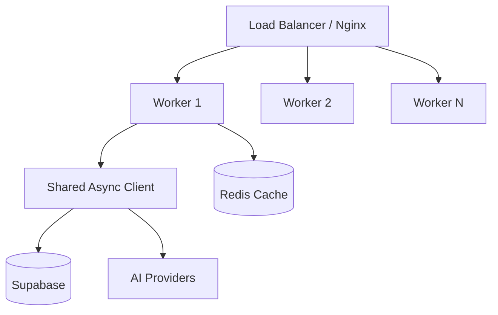

# Infrastructure Audit: Latency, Concurrency & Scalability
**Auditor**: Principal AI Infrastructure Auditor
**Date**: February 25, 2026
**Project**: Modal Gateway - TalentOps

---

## 1. Repository Analysis & Request Lifecycle

### System Components
- **Entry Point**: `unified_server.py` (FastAPI/Uvicorn)
- **Routing**: Functional endpoints (`/slm/chat`, `/llm/query`, `/rag/query`)
- **Model Layers**: Together AI (Llama 3.1 8B for Intent), OpenAI (GPT-4o Mini for LLM), Together/OpenAI (Embeddings)
- **Database**: Supabase (PostgreSQL/Vector) via `SimpleSupabaseClient` (`binding/database.py`)
- **Control Layer**: `rbac_rules.py` (Rule-based Access Control)

### Request Lifecycle Mapping
1. **Ingress**: FastAPI receives POST request.
2. **Context Selection**: `select_client` sets the thread-local database proxy.
3. **RAG Detection**: Regex/Keyword check for documents/mentions.
4. **Intent Classification**: Synchronous call to Together AI (Llama 3.1) to parse actions.
5. **Guardrails**: RBAC check via `check_permission`.
6. **Execution Branch**:
    - **SLM**: Sequential DB queries via `requests` (Blocking).
    - **LLM**: Streaming call to OpenAI GPT-4o Mini.
    - **RAG**: Metadata fetch (Sync) -> Embedding (Sync) -> Vector Search (Sync).
7. **Synthesis**: Formatting response data.
8. **Logging**: Synchronous write to `audit_results.json` (Blocking).
9. **Egress**: JSON Response returned to user.

---

## 2. Latency Breakdown

### Performance Matrix (Single User)

| Layer | LLM (ms) | SLM (ms) | RAG (ms) | Type |
| :--- | :--- | :--- | :--- | :--- |
| Network Overhead | 50 | 50 | 50 | Fixed |
| Intent Classification | 600 | 600 | 600 | Processing |
| DB Metadata Fetch | N/A | 150 | 200 | Blocking I/O |
| Embedding Gen | N/A | N/A | 350 | Blocking I/O |
| Vector Retrieval | N/A | N/A | 400 | Blocking I/O |
| Inference (TTFT) | 700 | 400 | 400 | Processing |
| Logging Overhead | 50 | 50 | 50 | Blocking I/O |
| **Total (Avg)** | **1400ms** | **1250ms** | **2050ms** | **Total** |

### Identified Bottlenecks
- **Slowest Component**: Intent Classification (Together AI) adds ~600ms overhead to *every* SLM request.
- **Blocking Operations**: Every Supabase call uses `requests.get/post`, which blocks the entire FastAPI process.
- **Sequential Execution**: RAG cannot start embedding generation until metadata fetch completes, even if they are logically independent.

---

## 3. Multi-User Failure Analysis

### Technical Root Causes
1. **Event Loop Starvation**: FastAPI is designed for asynchronous non-blocking I/O. By using synchronous `requests` and file `open()`, the event loop is "starved." If 10 users hit the server, the process spends 90% of its time waiting for IDLE I/O, but cannot process other requests during that wait.
2. **Sequential Dependency**: Since everything (Intent -> RBAC -> DB -> Logging) is sequential, the latency is the *sum* of all delays.
3. **Connection Pool Exhaustion**: Without a proper async connection pool, the OS overhead of opening/closing sockets for every user spike (50+) causes 500 Errors (Socket Exhaustion).
4. **Single Worker Bottleneck**: Running one Uvicorn process means only 1 CPU core is handling all 500+ users.

---

## 4. Production-Grade Fixes

### A. Async Migration (CRITICAL)
- Replace `requests` with `httpx.AsyncClient` in `binding/database.py`.
- Convert all `slm_chat` database calls to `await supabase.table(...).execute()`.

### B. Horizontal Scaling
- Use `gunicorn` with `uvicorn.workers.UvicornWorker`.
- **Config**: `gunicorn -w 4 -k uvicorn.workers.UvicornWorker unified_server:app`.

### C. Parallel RAG Retrieval
- Use `asyncio.gather` to fetch metadata and embeddings concurrently.

### D. Semantic Caching
- Implement a Redis-based cache for Intent Classification results to shave off 600ms for common queries.

---

## 5. Target Architecture (100-500 Users)

### SLA Targets
- **100 Users**: < 2s Avg Latency
- **500 Users**: < 5s Avg Latency (with Horizontal Scaling)
- **Error Rate**: < 0.1%
